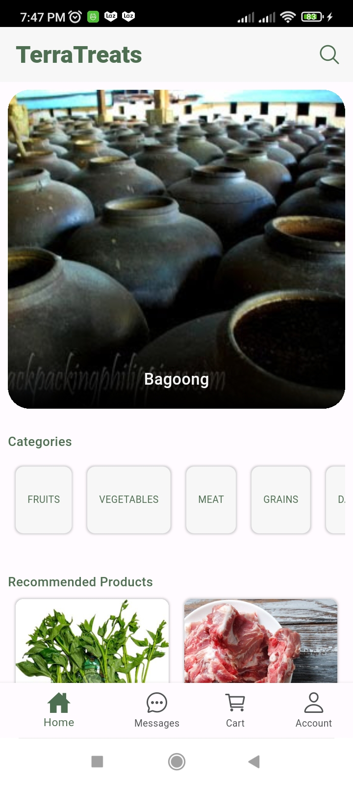
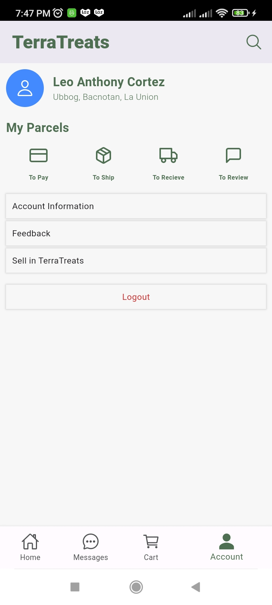
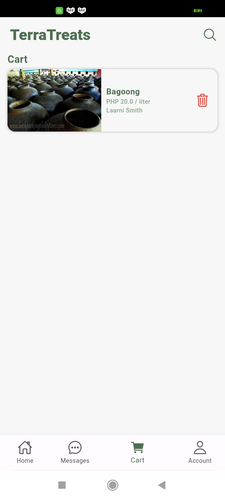
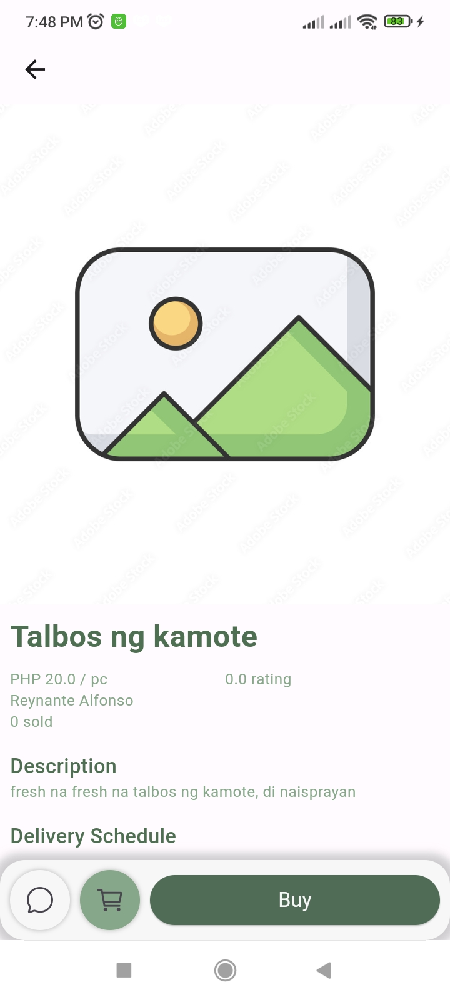

<div align="center">

<h2> TerraTreats </h2>








</div>

## 💡 Overview

**TerraTreats** is an e-commerce platform designed to empower farmers by connecting them directly with consumers. By eliminating the need for middlemen, TerraTreats enables farmers to sell their fresh, locally grown produce directly to end buyers — ensuring fair prices for both parties and promoting sustainable agriculture.

## ✨ Features

- **Farmer registration**
- **Consumer registration**
- **Product listing**
- **Shopping cart**
- **Checkout & payment system**
- **Search & filtering**

## 👩‍💻 Tech Stack

- **Flutter**: Used to build the mobile app interface for both farmers and consumers, enabling a smooth and responsive user experience across devices.
- **FastAPI**: Serves as the backend framework to handle API requests, providing fast and secure communication between the frontend and database.
- **PostgreSQL**: Acts as the relational database to store structured data such as user information, product listings, and order details.
- **Cloudinary**: Manages image storage and delivery for product photos uploaded by farmers, ensuring optimized and scalable media handling.
- **SQLAlchemy**: Provides an ORM layer to interact with the PostgreSQL database using Python models, simplifying database operations and query management.

## 📦 Getting Started

To get a local copy of this project up and running, follow these steps.

### 🚀 Prerequisites

- **Python** version 3.12
- **PostgreSQL** (or another supported SQL database).
- **Cloudinary**
- **Flutter** version 3.19.6
- **Dart** version 3.3.4

## 🛠️ Installation

1. **Clone the repository:**

   ```bash
   git clone https://github.com/exxsid/TerraTreats.git
   cd TerraTreats
   ```

### Client

1. **Go to client project folder**

   ```bash
   cd client
   ```

2. **Run the project**

   Make sure that an android emulator or a device is connected to your computer

   ```bash
   flutter run
   ```

### Server

1. **Go to server project folder**

   ```bash
   cd server
   ```

2. **Create a python virtual environment and install libraries**
   ```bash
   python -m venv .nvev
   .venv\Scripts\activate
   pip install -r requirements.txt
   ```
3. **Run the FastAPI using uvicorn**

   ```bash
   cd api
   uvicorn main:app --host <localhost/ip address> --port <port> --reload
   ```

### 🚀 Project Goal

The goal of TerraTreats is to provide an intuitive and user-friendly platform where:

- **Farmers** can list their products, manage inventory, and fulfill orders.
- **Consumers** can browse fresh agricultural goods, place orders, and connect directly with local producers.
- The community benefits from **reduced supply chain layers**, **fresher food**, and **fairer pricing**.

This project was built as a passion project to explore full-stack development while contributing to a meaningful cause: supporting local agriculture and sustainability.
